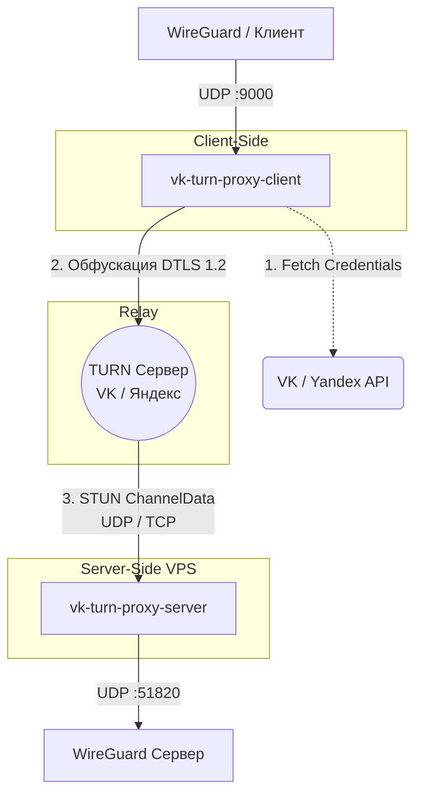

<div align="center">
  <h1>🛡️ Good TURN</h1>
  <p>
    <b>Проброс WireGuard / Hysteria через TURN серверы VK Звонков или Яндекс Телемоста</b>
  </p>
  <p>
    <a href="https://github.com/Mat1RX/vk-turn-proxy/releases">
      
    </a>
    <a href="https://aur.archlinux.org/packages/vk-turn-proxy-server-bin">
      
    </a>
    <a href="https://golang.org/">
      
    </a>
  </p>
</div>

---

> [!WARNING]
> **Внимание:** Проект создан **исключительно для учебных целей**! Автор не несет ответственности за использование данного ПО.

Трафик шифруется с помощью **DTLS 1.2** и передаётся через **STUN ChannelData**, маскируясь под легитимный WebRTC звонок в VK или Яндекс Телемост. Это делает его крайне сложным для выявления средствами DPI без блокировки всей инфраструктуры звонков платформы.

## ⚙️ Принцип работы



1. **Получение TURN-credentials**: Прокси обращается к API VK/Яндекса через ссылку на звонок для получения одноразовых доступов. DNS-запросы идут через резолверы VK (`77.88.8.8`) и Google для обхода локальных блокировок.
2. **DTLS 1.2 — слой обфускации**: Создается DTLS соединение к серверу. Рекомендуется использовать флаг `-secret` (Pre-Shared Key) для защиты от MitM-атак (перехвата трафика). Пакеты WireGuard инкапсулируются внутри DTLS-потока, обфусцируя сигнатуры для DPI.
3. **TURN relay**: Передача пакетов идет на TURN-сервер платформы, а он уже перенаправляет их на ваш VPS. Для **VK** дополнительно открывается 16 параллельных потоков для обхода ограничения скорости в ~5 Мбит/с.

---

## 🚀 Установка

### 🐧 Arch Linux (AUR)

Самый простой способ установки в Arch Linux с использованием AUR хелпера (например, `yay` или `paru`):

```bash
# Установка сервера
yay -S vk-turn-proxy-server-bin   # или -git для сборки из исходников

# Установка клиента
yay -S vk-turn-proxy-client-bin   # или -git для сборки из исходников
```

После установки настройте концигурационные файлы, раскомментировав `OPTS` и внеся нужные IP-адреса и ключи:  
`nano /etc/default/vk-turn-proxy-server`  
`nano /etc/default/vk-turn-proxy-client`  

Затем добавьте службы в автозагрузку и запустите:
```bash
sudo systemctl enable --now vk-turn-proxy-server
sudo systemctl enable --now vk-turn-proxy-client
```

### 🐳 Docker (сервер)

Вы можете развернуть серверную часть через Docker:

```bash
docker build -t vk-turn-proxy .
docker run -d -p 56000:56000/udp -e CONNECT_ADDR=192.168.1.10:51820 --name vk-turn-proxy vk-turn-proxy
```

---

## 🛠 Использование

**Что вам понадобится:**
- **Ссылка на VK Звонок** (`https://vk.com/call/join/...`). Создайте свой звонок, ссылка действует вечно (если не завершить для всех).
- *Или* **Ссылка на Яндекс Телемост** (`https://telemost.yandex.ru/j/...`).
- **VPS** с установленным и настроенным WireGuard сервером.

### Запуск сервера

На сервере (вашем VPS) выполните:

```bash
./vk-turn-proxy-server -listen 0.0.0.0:56000 -connect 127.0.0.1:<порт wg> -secret "my-strong-password"
```

### Запуск клиента

> [!CAUTION]
> **Важно:** В конфигурации клиента WireGuard укажите `Endpoint = 127.0.0.1:9000` и `MTU = 1280`. Не подключайте VPN до того, как `vk-turn-proxy-client` успешно установит соединение! (Для Linux/Windows)

**🐧 Linux:**
```bash
./vk-turn-proxy-client -peer <ip VPS>:56000 -vk-link <ссылка> -listen 127.0.0.1:9000 -secret "my-strong-password" | sudo routes.sh
```

**🪟 Windows** (PowerShell от имени Администратора):
```powershell
./client.exe -peer <ip VPS>:56000 -vk-link <ссылка> -listen 127.0.0.1:9000 -secret "my-strong-password" | routes.ps1
```

**📱 Android:** 
Лучше всего использовать адаптацию [vk-turn-proxy-android](https://github.com/MYSOREZ/vk-turn-proxy-android) или запустить клиентское ядро через Termux.

---

## 🎛 Флаги запуска клиента

| Флаг | Описание | По умолчанию |
|------|----------|--------------|
| `-peer` | **Обязательный.** Адрес вашего сервера `host:port` | - |
| `-vk-link` | Ссылка-инвайт на VK Звонок | - |
| `-yandex-link` | Ссылка-инвайт на Яндекс Телемост | - |
| `-listen` | Локальный интерфейс и порт для прослушивания трафика VPN | `127.0.0.1:9000` |
| `-secret` | **Рекомендуется.** PSK-пароль для защиты DTLS-рукопожатия от MitM атак | - |
| `-n` | Количество потоков TURN (рекомендуется `16` для VK, `1` для Яндекса) | `16` / `1` |
| `-udp` | Использовать UDP протокол для подключения к TURN | `false` (over TCP) |
| `-turn` | Указать IP TURN сервера вручную | - |
| `-no-dtls` | **Опасно.** Отключить слои обфускации (может привести к бану) | `false` |

---

## 🟡 Настройки для Яндекс Телемоста

> [!WARNING]
> **UPD: Сервис ТЕЛЕМОСТ почти ЗАКРЫЛИ**

Если вы все еще используете Я.Телемост, помните:
- По умолчанию следует использовать флаг `-n 1`, так как нет ограничений скорости.
- Увеличение числа `-n` может привести к бану по IP за обилие пустых (фейковых) подключений.
- Рекомендуется активировать флаг `-udp` в связке с конкретными IP адресами.

<details>
<summary><b>Список рабочих IP TURN серверов Яндекса</b> <i>(использовать с флагом <code>-turn</code>)</i></summary>

```text
5.255.211.241
5.255.211.242
5.255.211.243
5.255.211.245
5.255.211.246
```
</details>

---

## 🎭 Совместимость с V2Ray

Вместо WireGuard можно использовать `xray-core` или `sing-box`. Это позволит гибче настроить маршрутизацию (например, через SOCKS5 для точечного обхода блокировок). Примеры конфигураций:

<details>
<summary><b>💻 Клиент (xray)</b></summary>

```json
{
    "inbounds": [
        { "protocol": "socks", "listen": "127.0.0.1", "port": 1080,
          "settings": { "udp": true },
          "sniffing": { "enabled": true, "destOverride": ["http","tls"] } },
        { "protocol": "http", "listen": "127.0.0.1", "port": 8080,
          "sniffing": { "enabled": true, "destOverride": ["http","tls"] } }
    ],
    "outbounds": [
        { "protocol": "wireguard",
          "settings": {
              "secretKey": "<client secret key>",
              "peers": [{ "endpoint": "127.0.0.1:9000", "publicKey": "<server public key>" }],
              "domainStrategy": "ForceIPv4", "mtu": 1280
          }
        }
    ]
}
```
</details>

<details>
<summary><b>🌍 Сервер (xray)</b></summary>

```json
{
    "inbounds": [
        { "protocol": "wireguard", "listen": "0.0.0.0", "port": 51820,
          "settings": {
              "secretKey": "<server secret key>",
              "peers": [{ "publicKey": "<client public key>" }],
              "mtu": 1280
          },
          "sniffing": { "enabled": true, "destOverride": ["http","tls"] }
        }
    ],
    "outbounds": [
        { "protocol": "freedom", "settings": { "domainStrategy": "UseIPv4" } }
    ]
}
```
</details>

---

<div align="center">
  <sub>Основано на открытом исходном коде. Спасибо проекту <a href="https://github.com/KillTheCensorship/Turnel">Turnel</a> за часть кода. ❤️</sub>
</div>
